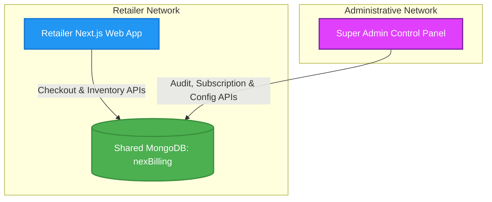

# NexBill System Architecture

NexBill is a multi-tenant Point of Sale (POS) Billing and Inventory Management system designed for retail shop owners. It features robust data isolation, a dynamic billing terminal, and real-time inventory adjustments.

---

## High-Level System Architecture

NexBill operates as a **dual-application system** connected to a unified MongoDB database (`nexBilling`). This architecture splits operations between retail terminals and super-administrative oversight.



### Shared Database Integration
- **Unified MongoDB database**: Both `billing-system-for-retailers` (Retailer POS App) and `billing--system-admin` (Super Admin App) connect directly to the same database.
- **Tenant Isolation**: Data segregation is enforced at the document level via a `shop` reference (`Schema.Types.ObjectId` referencing `Shop`) present on almost all schema models.

---

## Technical Stack

NexBill is constructed using modern, high-performance web standards:

| Layer | Technology | Purpose |
| :--- | :--- | :--- |
| **Core Framework** | Next.js 16 (App Router) | React server components, routing, and serverless API endpoints. |
| **View Layer** | React 19 / TypeScript | Strict type checking, component lifecycle, and UI state management. |
| **Database** | MongoDB & Mongoose 9.x | NoSQL storage with strict schema constraints and indexes. |
| **Styling** | Tailwind CSS & shadcn/ui | Premium, fluid responsive layouts. |
| **Authentication** | JWT (JSON Web Tokens) | Stateless sessions stored in HTTP cookies and local storage. |
| **File Parser** | SheetJS (XLSX) | Client-side spreadsheet parsing and verification for inventory imports. |

---

## Directory Organization

The codebase is organized logically, separating view layouts, REST endpoints, database schemas, and shared utilities:

```text
billing-system-for-retailers/
├── app/                      # Next.js App Router root
│   ├── api/                  # Backend REST API routes
│   │   ├── auth/             # Authentication & active session trackers
│   │   ├── products/         # Inventory catalogue & bulk excel parsers
│   │   ├── invoices/         # Invoice creation & update routes
│   │   └── shop/             # Subscription state & payment audit GETs
│   ├── auth/                 # Signup and Sign-in pages
│   ├── dashboard/            # Protected cashier pages
│   │   ├── billing/          # Invoices history, print invoice pages
│   │   ├── products/         # Inventory stock sheets & new item triggers
│   │   ├── settings/         # Shop profiles, billing QR codes, subscription history
│   │   └── page.tsx          # Analytics panel & dashboard landing page
│   ├── globals.css           # Global CSS variables & layout resets
│   └── layout.tsx            # App framework & grace/lockout warning wrappers
├── components/               # Shared React UI components
│   ├── ui/                   # shadcn design system component primitives
│   ├── BillingForm.tsx       # Billing ticket cashier terminal component
│   ├── ProductForm.tsx       # Product specifications and unit modifier form
│   ├── CustomerForm.tsx      # Customer profiles form
│   └── BulkUploadModal.tsx   # Drag-and-drop parser modal for imports
├── models/                   # Mongoose database models
│   ├── Shop.ts               # Subscription terms, grace records & activity trackers
│   ├── Product.ts            # Inventory items with pricing, category, & units
│   ├── Invoice.ts            # Invoiced ticket item arrays and adjustments
│   └── SystemConfig.ts       # Central admin configs (e.g. payment QR url)
├── lib/                      # Helper utilities
│   ├── db.ts                 # MongoDB connection instantiation (w/ caching)
│   ├── auth.ts               # JWT validation and signature helpers
│   └── api.ts                # HTTP JSON response wrappers
└── middleware.ts             # Global router session gatekeeper
```

---

## Technical Highlights

### 1. Database Connection Pooling
To prevent connection exhaustion in serverless environments, NexBill caches the Mongoose connection locally:
```typescript
let cached = global.mongoose;
if (!cached) {
  cached = global.mongoose = { conn: null, promise: null };
}
export async function connectDB() {
  if (cached.conn) return cached.conn;
  if (!cached.promise) {
    cached.promise = mongoose.connect(MONGODB_URI, opts).then(m => m);
  }
  cached.conn = await cached.promise;
  return cached.conn;
}
```

### 2. Tenant Isolation Enforcement
Middleware and helper scripts validate the JWT token inside request headers/cookies to extract the user's `shopId`. Every subsequent Mongoose query attaches this filter:
```typescript
const auth = extractAuthFromRequest(request);
const products = await Product.find({ shop: auth.shopId });
```

### 3. Grace & Blocker Period Gating
The layout gate checks the current shop's subscription date. It computes elapsed time to determine whether to:
- Allow access cleanly (Subscription Active).
- Allow access but render a warning banner (Grace Period: `Date.now() > subscriptionExpiresAt && elapsedDays <= 3`).
- Lock out the terminal completely and prompt for payment (Lockout Period: `elapsedDays > 3`).
