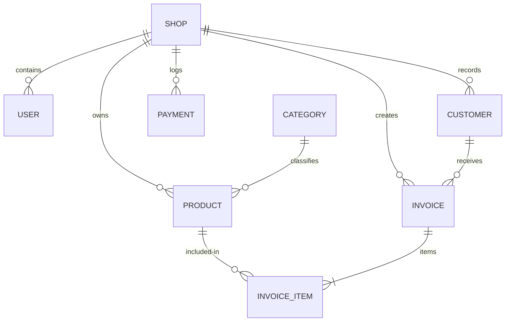

# Database Schema & Model Reference

NexBill uses MongoDB with Mongoose ODM schemas. This document details the database layout, types, and model indices.

---

## Model Relationships

---

## 1. Shop Schema (`models/Shop.ts`)

Represents a tenant shop, tracking subscription terms and system activity levels.

| Field Name | Type | Constraints | Description |
| :--- | :--- | :--- | :--- |
| **name** | `String` | Required, Trim | Registered name of the retail store. |
| **email** | `String` | Trim | Owner email. |
| **phone** | `String` | Trim | Primary store contact mobile number. |
| **address** | `String` | | Physical address. |
| **gstin** | `String` | Trim | Business GSTIN details (optional). |
| **license** | `String` | | Business registry license number. |
| **subscriptionStatus** | `String` | Enum, Default: `'trialing'` | Session terms: `'active'`, `'trialing'`, `'unpaid'`, `'past_due'`, `'suspended'`. |
| **subscriptionPlan** | `String` | Enum, Default: `'free_trial'` | Plan level: `'monthly'`, `'yearly'`, `'free_trial'`. |
| **subscriptionExpiresAt** | `Date` | | Date the store terminal locks down. |
| **trialEndsAt** | `Date` | | Ending date for the 14-day free trial. |
| **lastPaymentDate** | `Date` | | Audit date of last manual extension log. |
| **lastActiveAt** | `Date` | | Session polling heartbeat updated every 15s. |

- **Indices**:
  - `{ email: 1 }` (sparse, unique index for search validation)

---

## 2. Product Schema (`models/Product.ts`)

Represents cataloged inventory items.

| Field Name | Type | Constraints | Description |
| :--- | :--- | :--- | :--- |
| **name** | `String` | Required, Trim | Invoiced title of the item. |
| **sku** | `String` | Required, Trim | Unique SKU code (forced to Uppercase). |
| **category** | `ObjectId` | Ref: `'Category'`, Required | Reference to classification model. |
| **unit** | `String` | Default: `'pcs'`, Trim | Unit of measure (e.g. `'pcs'`, `'kg'`, `'litre'`). |
| **unitPrice** | `Number` | Required, Min: 0 | Invoiced selling price per unit. |
| **costPrice** | `Number` | Required, Min: 0 | Cost price to determine profit margins. |
| **stock** | `Number` | Required, Default: 0 | Decimal stock remaining (e.g. `45.25`). |
| **reorderLevel** | `Number` | Default: 10 | Triggers warning when `stock` falls below this level. |
| **taxApplicable** | `Boolean` | Default: `true` | Apply 18% standard GST. |
| **imageUrl** | `String` | | Uploaded image path on Cloudinary. |
| **shop** | `ObjectId` | Ref: `'Shop'`, Required | Owner shop tenant ID. |

- **Indices**:
  - `{ shop: 1, category: 1 }` (improves catalogue browsing speed)
  - `{ shop: 1, sku: 1 }` (unique constraint within the same shop)

---

## 3. Invoice Schema (`models/Invoice.ts`)

Represents finalized sales receipt documents.

| Field Name | Type | Constraints | Description |
| :--- | :--- | :--- | :--- |
| **invoiceNumber** | `String` | Required, Unique | Formatted sequential ID (e.g., `INV-1004`). |
| **customer** | `ObjectId` | Ref: `'Customer'`, Required | Associated buyer profile. |
| **items** | `Array` | Sub-document list | List of purchased items (see sub-document schema below). |
| **subtotal** | `Number` | Required, Min: 0 | Ticket items cost sum (pre-discount). |
| **taxAmount** | `Number` | Required, Min: 0 | Accumulated GST tax amount. |
| **discountAmount**| `Number` | Default: 0, Min: 0 | Total cash discount adjustment. |
| **total** | `Number` | Required, Min: 0 | Final grand total bill (`subtotal - discount`). |
| **paymentMethod** | `String` | Enum, Default: `'cash'` | Method: `'cash'`, `'card'`, `'online'`, `'credit'`. |
| **paymentStatus** | `String` | Enum, Default: `'unpaid'` | Status: `'paid'`, `'unpaid'`, `'partial'`. |
| **notes** | `String` | | Terminal receipts remarks. |
| **shop** | `ObjectId` | Ref: `'Shop'`, Required | Associated tenant shop. |

### Invoice Item Sub-document Schema
Each element inside the `items` array follows this schema layout:

| Field Name | Type | Constraints | Description |
| :--- | :--- | :--- | :--- |
| **product** | `ObjectId` | Ref: `'Product'`, Required | Purchased product reference. |
| **quantity** | `Number` | Required, Min: 0 | Purchased count/weight (supports decimals, e.g. `1.75`). |
| **price** | `Number` | Required, Min: 0 | Price per unit locked at invoice time. |
| **tax** | `Number` | Required, Min: 0 | Calculated line tax. |
| **subtotal** | `Number` | Required, Min: 0 | Invoiced item subtotal (`quantity * price`). |

- **Indices**:
  - `{ shop: 1, createdAt: -1 }` (optimizes date-filtered history API queries)
  - `{ customer: 1, shop: 1 }` (speeds up customer ledger lookup queries)
  - `{ invoiceNumber: 1 }` (enforces unique receipt lookup keys)

---

## 4. Payment Schema (`models/Payment.ts`)

Logs admin manually recorded payment extensions for auditing purposes.

| Field Name | Type | Constraints | Description |
| :--- | :--- | :--- | :--- |
| **shop** | `ObjectId` | Ref: `'Shop'`, Required | Retailer shop ID. |
| **amount** | `Number` | Required | Paid subscription amount. |
| **paymentDate** | `Date` | Default: `Date.now` | Payment completion date. |
| **billingPeriodStart** | `Date` | | Starting date of extended month. |
| **billingPeriodEnd** | `Date` | | Ending date of extended month. |
| **status** | `String` | Enum, Default: `'paid'` | Status: `'paid'`, `'pending'`, `'failed'`. |
| **paymentMethod** | `String` | Enum, Default: `'manual'`| Method: `'upi'`, `'cash'`, `'card'`, `'manual'`. |
| **referenceId** | `String` | | UPI transaction reference ID. |

---

## 5. SystemConfig Schema (`models/SystemConfig.ts`)

Global config system variables configured by Super Admin app.

| Field Name | Type | Constraints | Description |
| :--- | :--- | :--- | :--- |
| **paymentQrCodeUrl** | `String` | | URL of the central payment QR code. |
| **whatsappNumber** | `String` | Default: `"+919600950190"` | WhatsApp number for manual screenshots. |
