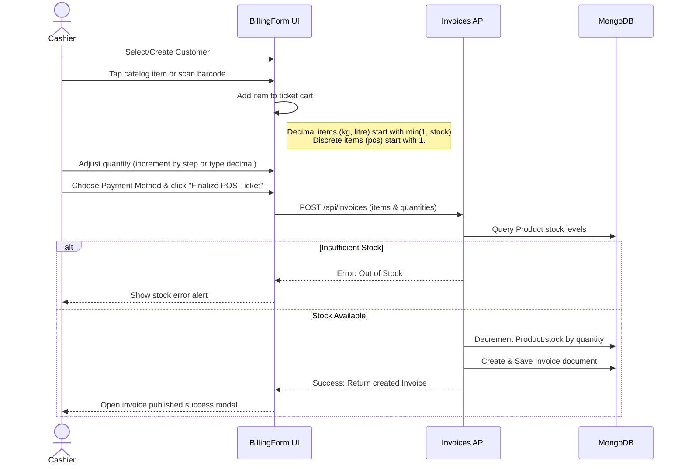
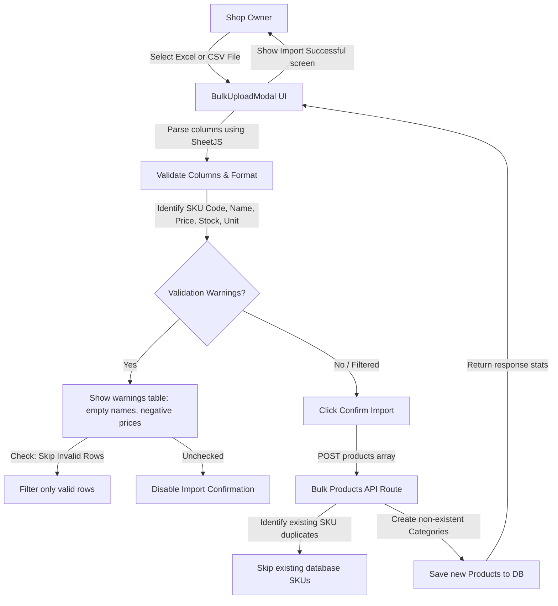
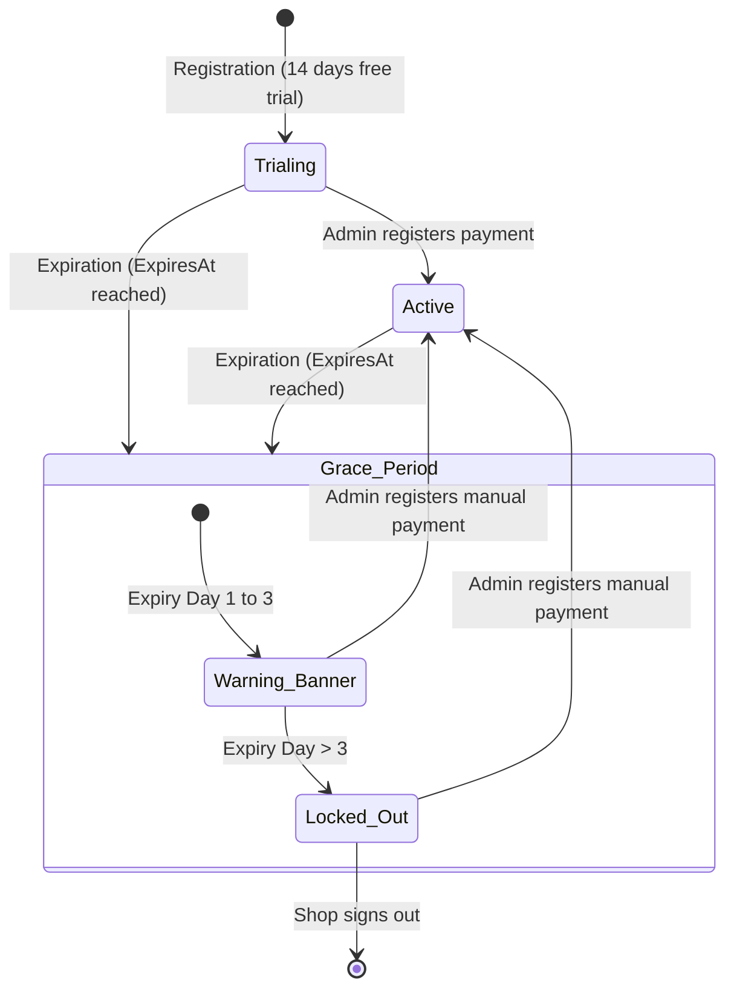

# System User Flows & Lifecycles

This document describes the operational workflows and user lifecycles within the NexBill application.

---

## 1. Cashier Billing & Checkout Flow

The POS checkout terminal is the central interface for retail sales. Cashiers search items, set customer associations, apply discounts, and complete sales transactions.

### Key UI Features
- **Manual Input**: Cashiers can click standard increment buttons (which adjust quantity by `0.1` for decimal items and `1` for discrete items) or type custom decimals (e.g. `2.25`) directly in the cart's numeric input.
- **WhatsApp Share**: Upon checkout finalization, cashiers can click "Share WhatsApp" to generate a pre-formatted message that redirects to the client's WhatsApp number using a `whatsapp://send` deep link.

---

## 2. Product Ingestion & Bulk Import Flow

NexBill allows shop owners to upload bulk product files (CSV or Excel) to rapidly seed their inventory database.

### Ingestion Logic
- **Header Normalization**: The parser matches columns resiliently based on common headers (e.g. mapping `'uom'`, `'measurement'`, and `'unit'` all to the model's `unit` field).
- **Float Parsing**: Quantities and reorder parameters are parsed as floats (`parseFloat`) to accommodate weight/volume measurements (e.g. `250.5` kg of sugar).
- **Duplicate Prevention**: Existing database SKUs are skipped during bulk save to prevent unique database index violations.

---

## 3. Subscription Grace & Lockout Flow

Shop owners pay a recurring flat fee to keep their POS terminals active. If the subscription expires, a grace period begins.

### Verification Pipeline
1. **Status Poll**: The retailer app frequently polls `/api/auth/status`. If authenticated, it updates `lastActiveAt` on the `Shop` schema to track active connections.
2. **Access Evaluation**: The root wrapper evaluate shop subscription values:
   - If `Date.now() <= shop.subscriptionExpiresAt`, the terminal is fully active.
   - If `Date.now() > shop.subscriptionExpiresAt`, the system calculates elapsed days:
     - **Days <= 3**: Renders a warning notification banner: *"Your subscription expired X days ago. Please pay to avoid POS lockout."*
     - **Days > 3**: Interrupts execution and displays a full-screen locking backdrop containing the admin's central UPI QR code, renewal instructions, and a logout button.
3. **Manual Audit & Unlock**:
   - The retailer pays and shares the screenshot to the admin's WhatsApp: `+91 96009 50190`.
   - The Super Admin verifies the receipt, clicks "Record Manual Payment" in the super control panel, which issues a `POST /api/shops` payload to log a new `Payment` audit, updates the shop subscription to `'active'`, and extends `subscriptionExpiresAt` by 30 days.
   - The retailer's blocker overlay disappears immediately on the next auth check.
